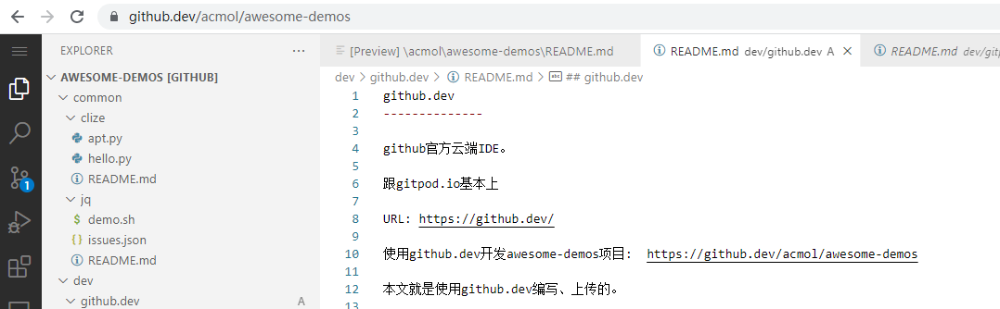

github.dev
--------------

github官方云端代码编辑器。

看着和gitpod.io基本一样，但我没说它是IDE是因为它虽然也是基于vscode online，但没有提供编译、执行的云端容器，所以只能算个代码编辑器。
(以前似乎提供过开发环境，可能是太烧钱了，暂时找不到了)

URL: https://github.dev/

使用github.dev开发awesome-demos项目:  https://github.dev/acmol/awesome-demos

本文就是使用github.dev编写、上传的。

