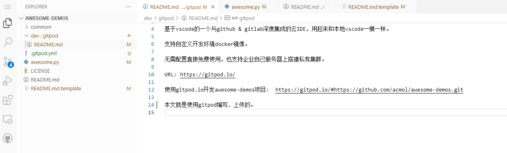

gitpod
--------------

基于vscode的一个与github & gitlab深度集成的云IDE，用起来和本地vscode一模一样。

支持自定义开发环境docker镜像，可以 ctrl + j 打开terminal为所欲为。

开源项目无需配置直接免费使用50个小时，也支持企业自己服务器上搭建私有集群。

URL: https://gitpod.io/

使用gitpod.io开发awesome-demos项目:  https://gitpod.io/#https://github.com/acmol/awesome-demos.git

本文就是使用gitpod编写、上传的。

