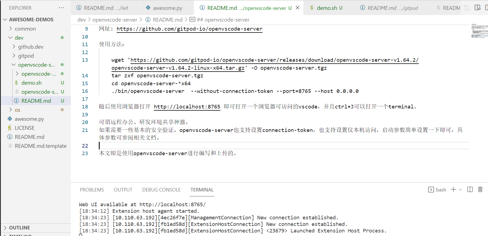

openvscode-server
------------------

一个可以在自己服务器上搭建的云端IDE，下载解压后，一条命令即可启动一个可以在浏览器里打开的vscode开发环境。
gitpod不适合用在公司对数据安全性有要求、不允许使用外部服务的场景，这时，你可以使用openvscode-server。
它是gitpod所在公司出品的开源项目。

网址: https://github.com/gitpod-io/openvscode-server

使用方法：

    wget 'https://github.com/gitpod-io/openvscode-server/releases/download/openvscode-server-v1.64.2/openvscode-server-v1.64.2-linux-x64.tar.gz' -O openvscode-server.tgz
    tar zxf openvscode-server.tgz
    cd openvscode-server-*x64
    ./bin/openvscode-server  --without-connection-token --port=8765 --host 0.0.0.0

随后使用浏览器打开 http://localhost:8765 即可打开一个浏览器可访问的vscode，并且ctrl+J可以打开一个terminal。

可谓远程办公、研发环境共享神器。

如果需要一些基本的安全验证，openvscode-server也支持设置connection-token，也支持设置仅本机访问，启动参数简单设置一下即可，具体参数可参阅相关文档。

本文即是使用openvscode-server进行编写和上传的。

